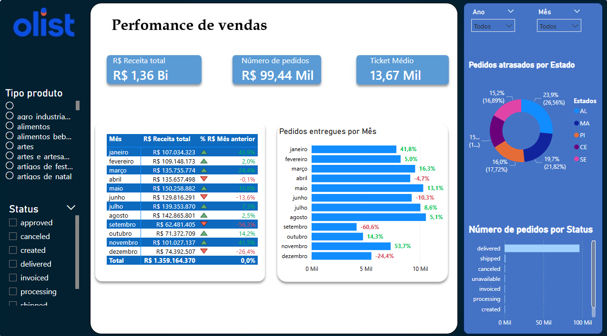
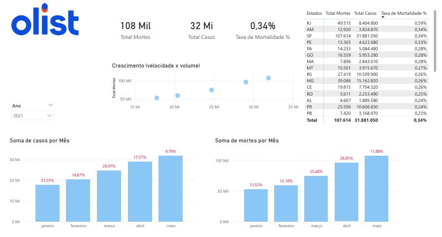

# Dashboard de Vendas - Treinamento BI

Este projeto consiste em uma análise de dados de vendas, utilizando bases de dados reais para gerar insights através de dashboards interativos.

## 📊 Visualização do Projeto

### 1. Dashboard de Vendas (Treinamento)
Abaixo está uma prévia do dashboard de vendas inicial:

### 2. Performance de Vendas (Olist E-Commerce)
Nova tela adicionada focada em logística e performance de vendas no marketplace Olist:

*   **Receita Total:** R$ 1,36 Bilhões.
*   **Número de Pedidos:** 99,44 Mil.
*   **Ticket Médio:** R$ 13,67 Mil.
*   **Insights de Logística:** Análise de pedidos atrasados por estado (TOP 5) e volume de entregas mensal.

### 3. Análise de Coronavírus (Brasil)
Dashboard focado na evolução da pandemia de COVID-19 no Brasil:

*   **Total de Mortes:** 108 Mil (Base 2021).
*   **Total de Casos:** 32 Mi.
*   **Taxa de Mortalidade:** 0,34%.
*   **Insights:** Evolução mensal de casos e mortes, análise de volume por estado e ranking de mortalidade.

## 🗂 Estrutura dos Dados

O projeto utiliza duas fontes principais de dados:

### Base de Treinamento (Excel)
Localizada na pasta `BaseDados`:
1.  **`BaseVendasCompleta.xlsx`:** Registro detalhado das transações comerciais.
2.  **`CadastroProdutos.xlsx`:** Tabela dimensão com detalhes dos produtos.

### Base Olist (CSV)
Localizada na pasta `BaseDados2`:
*   **`olist_orders_dataset.csv`:** Status do pedido, timestamps de compra e entrega.
*   **`olist_order_items_dataset.csv`:** Itens, preços e fretes.
*   **`olist_customers_dataset.csv`:** Localização do cliente por CEP, cidade e estado.
*   **`olist_products_dataset.csv`:** Categorias e dimensões dos produtos.

### Base Coronavírus (CSV)
Localizada na pasta `BaseDados3`:
*   **`brazil_covid19.csv`:** Dados consolidados por data.
*   **`brazil_covid19_cities.csv`:** Detalhamento por município.
*   **`brazil_population_2019.xlsx`:** Base populacional para cálculo de taxas.
*   **`brazil_cities_coordinates.csv`:** Coordenadas para visualização em mapas.

## 🛠 Tecnologias Utilizadas

*   **Excel / CSV:** Para armazenamento e pré-processamento dos dados.
*   **Power BI:** Para modelagem de dados (Star Schema/Snowflake) e criação do dashboard interativo.
*   **DAX:** Utilizado para criação de medidas complexas como Receita Total e Ticket Médio.

## 🚀 Como Utilizar

1.  Clone este repositório.
2.  Acesse as pastas `BaseDados`, `BaseDados2` e `BaseDados3` para verificar os arquivos originais.
3.  Abra os arquivos `.pbix` (`Treinamento-BI.pbix`, `Perfomance-de-Vendas.pbix`, `Analise-Coronavirus.pbix`) no Power BI Desktop para interagir com os dados.
